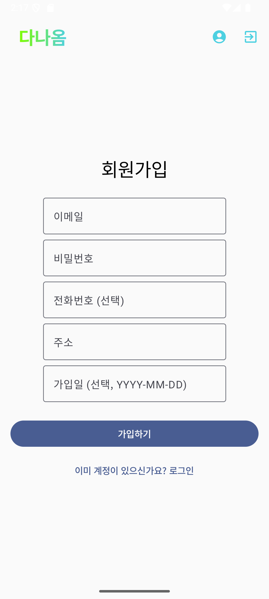

# 다나옴 (DanaOm) - Android 상품 검색 및 찜 목록 관리 앱

**다나옴(DanaOm)**은 Jetpack Compose와 최신 Android 개발 기술을 활용하여 구축된 **상품 검색** 및 사용자 맞춤 기능을 제공하는 Android 애플리케이션입니다. 
외부 API(예: Naver Shopping API)를 통해 원하는 상품을 검색하고, 사용자별 찜 목록 관리, 회원 정보 수정 등 다양한 편의 기능을 제공합니다.

## ✨ 주요 기능

*   **🛍️ 실시간 상품 검색 및 필터링**:
    *   외부 상품 API(예: Naver Shopping API) 연동하여 키워드 기반 상품 검색
    *   다양한 정렬 옵션 제공 (예: 관련도순, 가격순)
    *   HTML 태그가 제거된 깔끔한 상품 정보 및 이미지 표시
    *   상품 클릭 시 인앱 WebView 또는 외부 브라우저를 통해 상세 페이지로 이동
*   **📜 무한 스크롤**:
    *   `LazyColumn`과 `rememberLazyListState`를 활용하여 스크롤 시 다음 상품 목록 자동 로드
    *   끊김 없는 부드러운 상품 탐색 경험 제공
*   **👤 사용자 인증 및 관리**:
    *   Room 데이터베이스를 활용한 로컬 사용자 계정 관리 (회원가입, 로그인, 로그아웃)
    *   입력 유효성 검사 및 안전한 사용자 정보 처리
    *   **관리자 기능**: 모든 사용자 목록 조회 및 개별 사용자 정보 수정/삭제 (관리자 계정)
*   **💖 찜 목록 (Wishlist)**:
    *   관심 상품을 찜 목록에 추가/삭제 (실시간 UI 반영)
    *   사용자별 찜 목록 데이터를 Room DB에 로컬 저장
*   **📄 마이페이지**:
    *   로그인한 사용자의 정보 확인 및 수정 (이메일, 주소, 전화번호 등)
    *   찜 목록 바로가기
    *   

## 🛠️ 기술 스택 및 주요 라이브러리

*   **UI**:
    *   [Jetpack Compose](https://developer.android.com/jetpack/compose): 선언형 UI 툴킷
    *   [Material Design 3](https://m3.material.io/): 최신 디자인 시스템
    *   [Coil](https://coil-kt.github.io/coil/): 이미지 로딩 라이브러리 (Compose 지원)
*   **Architecture**:
    *   MVVM (Model-View-ViewModel)
*   **Navigation**:
    *   [Navigation Compose](https://developer.android.com/jetpack/compose/navigation)
*   **Asynchronous Programming**:
    *   [Kotlin Coroutines](https://kotlinlang.org/docs/coroutines-overview.html)
    *   [Kotlin Flow](https://kotlinlang.org/docs/flow.html) (StateFlow, SharedFlow)
*   **Networking**:
    *   [Retrofit 2](https://square.github.io/retrofit/): HTTP 클라이언트 (외부 상품 API 연동)
    *   [OkHttp 3](https://square.github.io/okhttp/): 로깅 인터셉터 등
*   **Local Data Persistence**:
    *   [Room Persistence Library](https://developer.android.com/training/data-storage/room)
*   **Language**:
    *   [Kotlin](https://kotlinlang.org/) (100%)
 

## 실행화면
### 일반 유저
#### 1. 회원가입 

 

